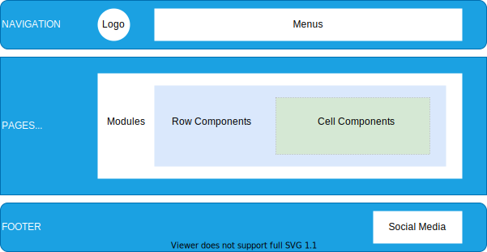

The image below describes the website structure for [lwm2m.openmobilealliance.org](https://lwm2m.openmobilealliance.org/).

* Header
* Pages
* Footer

<figure>
      
      <figcaption>Website Structure</figcaption>
</figure>

### Header

The content of this block contains clickable items such as [`logo`](), [`menus`]() and [`submenus`]().

### Pages

The main placeholder for the content is the `page`. 
A `page` is formed by `containers` that are boxes stacked one of top of each other and spreaded across the width of the webpage. Each `container` can contain one or more `modules`. The basic type of content that can be inserted inside of a `module` are: `image`, `text`, `table`, `blank-separator`, `news-card`, `blog-card`, etc.

Inside of a `container` is possible to insert a `module` which in turn contains another `module`. The above image depictures an example where one `container` contains a `module`, called `rowMultiColumns` - a table with two columns - in one of the columns is inserted a `rowNewList` module and in other column is inserted a `rowButtonGrid` module.

It also possible to concatenate two `modules` inside of a `container`, e.g. a text section on the left followed by a imgage to the right, called `rowTextImage` or the reserve an image to the left followed by a text to the right, called `rowImageText`.

### Footer

The `footer` contains OMA copyright statement and its `social media` icons.

In the next section [Structure](structure.md#structure) you can see how each of these components is structured.